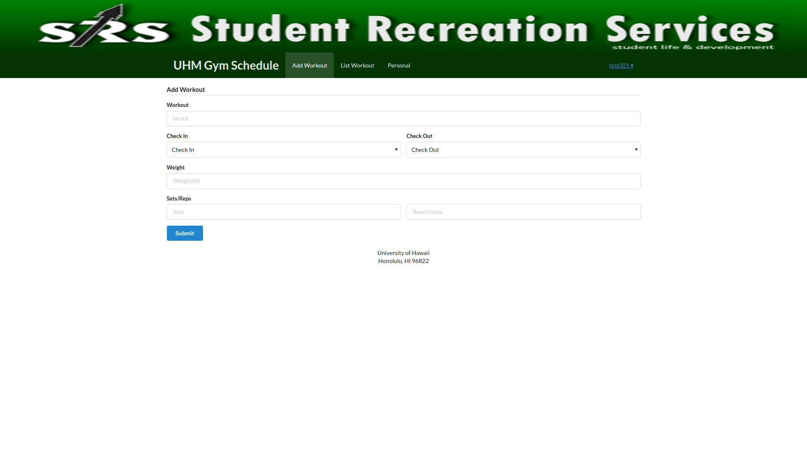
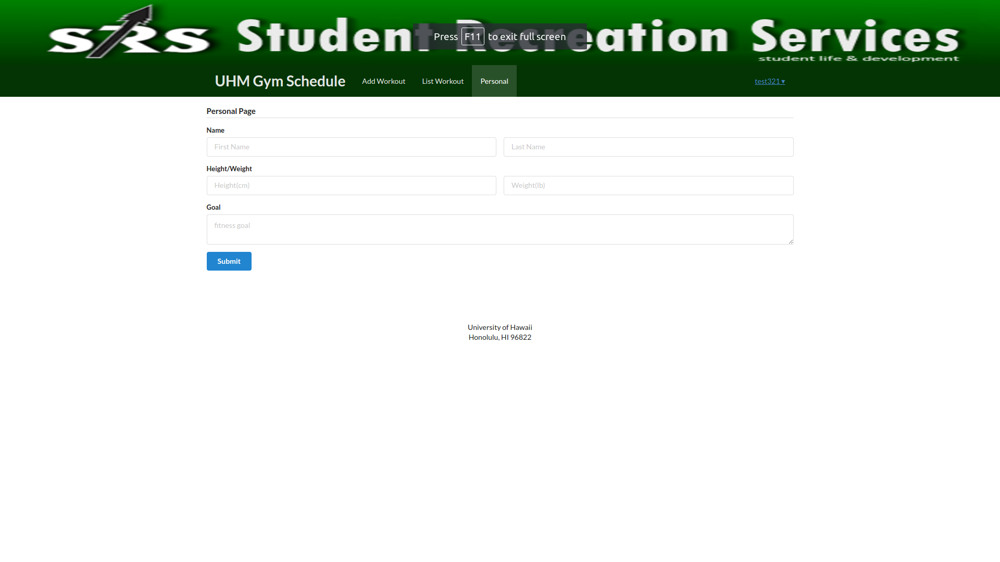

# Table of contents
* [About Warrior Scheduler](#about-warrior-scheduler)
* [Home Page](#home-page)

# About Warrior Scheduler

Warrior Scheduler is a Meteor scheduling application that allows students and faculty keep track of how busy the gym will be at any given time. A user will simply input the time they wish to go to the gym and it will appear on a calendar for everyone to see. Users will also be able to keep track of the amount of weights they use for each machine.

# Home Page

# Milestone 1

