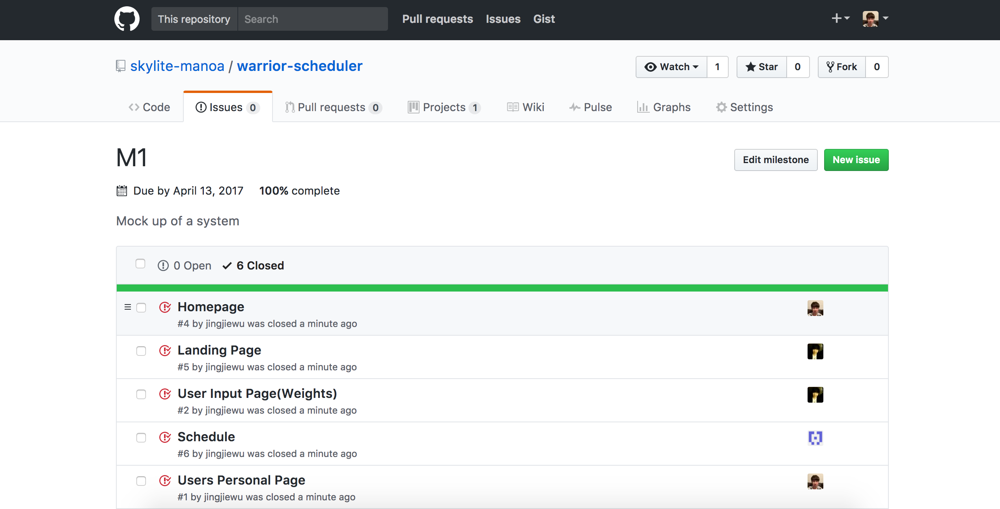
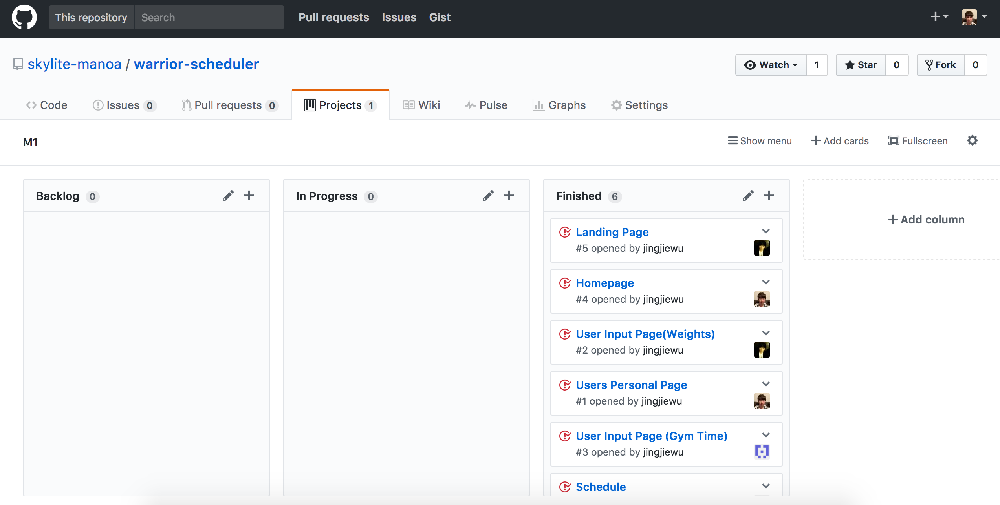

# Table of contents
* [About Warrior Scheduler](#about-warrior-scheduler)
* [Home Page](#home-page)
* [Development history](#development-history)
  * [Milestone 1](#milestone-1)

# About Warrior Scheduler

Warrior Scheduler is a Meteor scheduling application that allows students and faculty keep track of how busy the gym will be at any given time. A user will simply input the time they wish to go to the gym and it will appear on a calendar for everyone to see. Users will also be able to keep track of the amount of weights they use for each machine.

# Home Page

# Development History

## Milestone 1

This milestone started on April 6, 2017 and ended on April 13, 2017.

The goal of Milestone 1 was to create the GUI using meteor.
Mockups for the following pages were implemented during M1:

Milestone 1 was implemented as [warrior-scheduler GitHub Milestone M1](https://github.com/skylite-manoa/warrior-scheduler/milestone/1):

Milestone 1 consisted of five issues, and progress was managed via the [warrior-scheduler GitHub Project M1](https://github.com/skylite-manoa/warrior-scheduler/projects/2):

The program was successfully deploy on galaxy (https://galaxy.meteor.com/app/warrior-scheduler.meteorapp.com)

## Milestone 2
This milestone started on April 14, 2017 and is ongoing.

The goal of Milestone 2 is to update all of the mockup pages and some new implementations.

Milestone 2 was implemented as [warrior-scheduler GitHub Milestone M2](https://github.com/skylite-manoa/warrior-scheduler/milestone/2):

Milestone 2 consisted of five issues, and progress was managed via the [warrior-scheduler GitHub Project M2](https://github.com/skylite-manoa/warrior-scheduler/projects/3):
